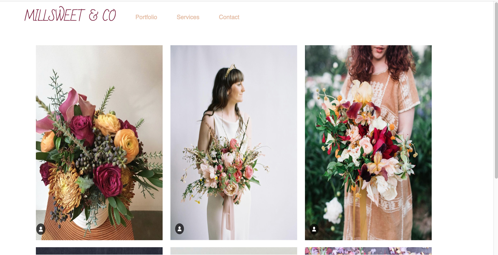
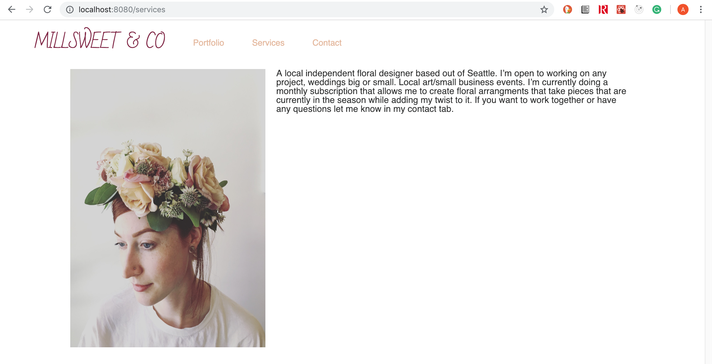
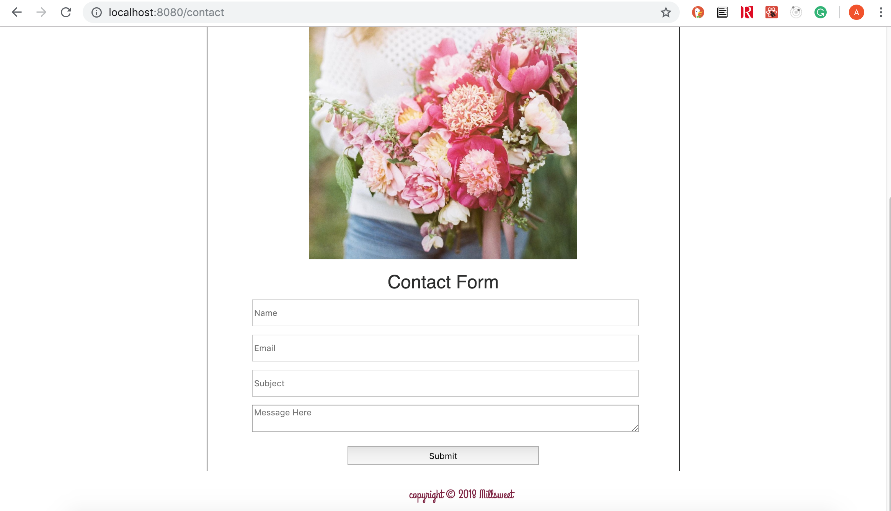

# Millsweet Flower Co

### Profile 
Sample site, for a Seattle based floral artist. 
This is a sample site, to practice building a wire-frame using React. 

- If you would like to see the site on your local machine, just clone this repo.
- In your terminal run - _**npm install**_ 
- Than run - _**npm run watch**_

Features I would work on to make it more functional:

- Form to properly work
- More photos in portfolio 
- Make a home page, that would show current and upcoming events that would allow users to know
- Sign in page, build a cart system that would allow you to pay online with debit/credit
- On sign in page, create a google oAuth page to allow easier sign in

### Built

Site built with React

## Photos of Design 
- Version 1.2 

### Designed and Created

Brai Frauen
